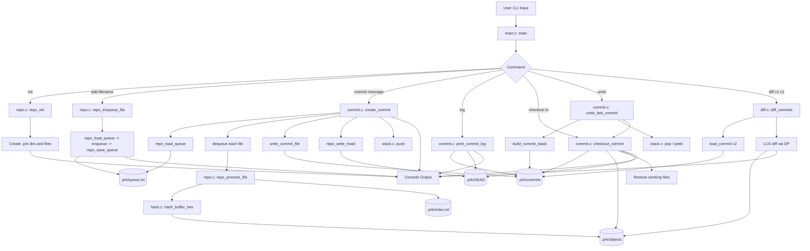

# prk - Version Control System (C99)


## Objective of the Project

The objective of this project is to simulate the working of a version control system like Git using only C (C99), without relying on external libraries.

This project demonstrates how core version control mechanisms operate internally, including:
- File tracking and staging
- Content-based storage using hashing
- Commit creation with parent linkage
- Version history traversal
- File restoration (checkout)
- Difference detection between versions<br /><br />
This helps in understanding real-world systems like Git at a low-level, system design perspective.
---
## Step-by-Step Explanation

### Stage 1: Basic CLI Structure
- Implemented command-line interface using `main.c`
- Parsed commands using `argc` and `argv`
- Routed commands like `init`, `add`, `commit`, etc.

**Concept Used**
- Basic control flow (no major DSA)

---

### Stage 2: Repository Initialization
- Created `.prk/` directory structure
- Initialized:
  - `HEAD`
  - `index.txt`
  - `queue.txt`

**Concept Used**
- File system operations

---

### Stage 3: Staging Area (Queue)
- Implemented queue using circular array
- Files added using `add` command are enqueued

**Concept Used**
- Queue (FIFO)

**Why**
- Maintains order of file processing

---

### Stage 4: File Tracking (Linked List)
- Implemented `FileEntry` linked list
- Stores filename and corresponding hash

**Concept Used**
- Linked List

**Why**
- Dynamic size and efficient insertion

---

### Stage 5: Hashing Mechanism
- Implemented DJB2 hash function
- Converts file content into unique hash

**Concept Used**
- Hashing

**Why**
- Enables content-addressable storage

---

### Stage 6: Commit System
- Created commit structure with:
  - commit id
  - parent
  - timestamp
  - file list

**Concept Used**
- Linked list + hashing

**Why**
- Stores snapshot of repository state

---

### Stage 7: Commit History (Stack)
- Implemented stack for managing commits
- Used in undo functionality

**Concept Used**
- Stack (LIFO)

**Why**
- Last commit is undone first

---

### Stage 8: Diff Implementation
- Implemented Longest Common Subsequence (LCS)
- Compared file versions line-by-line

**Concept Used**
- Dynamic Programming

**Why**
- Efficiently detects differences between files

---

## Workflow


---


## Input and Output


### Stage 1: Basic CLI Structure

This stage demonstrates the command-line interface of the system, where user inputs are parsed using **`argc`** and **`argv`**. The program validates commands and routes them to the respective modules. It provides usage instructions, ensuring correct syntax for operations. This forms the entry point and control layer of the system.

<p align="center">
  
</p>

---

### Stage 2-4: Initialize, Add and Commit (File Tracking)

The repository is initialized by creating the **`.prk`** directory structure along with metadata files like **`HEAD`**, **`index`**, and **`queue`**. Files are added to a staging queue and then processed during **commit**. Each file is hashed, stored as an object, and indexed. A commit snapshot is created containing metadata and file mappings.

<p align="center">
  
</p>
---

### Stage 5-6: Unique Hashing and Commit History

Each file’s content is converted into a unique **hash**, enabling content-addressable storage. Commits are linked using **parent references**, forming a chronological history chain. The **`log`** command traverses this chain to display commit details. This ensures traceability and version tracking.

<p align="center">
  
</p>

---

### Stage 8: Difference Between Versions (LCS Algorithm)

This stage shows comparison between two commits using the **Longest Common Subsequence (LCS)** algorithm. File contents are analyzed line-by-line to detect additions and deletions. The output highlights changes using **`+`** and **`-`** indicators. This provides an efficient method to visualize differences between versions.

<p align="center">
  
</p>

---

### Stage 7: Rollback Using Undo

The **undo** operation removes the latest commit using a **stack-based approach**. It restores the repository to the previous commit state by updating **`HEAD`** and reloading files. This ensures safe rollback functionality. It follows **LIFO** behavior, undoing the most recent changes first.

<p align="center">
  
</p>

---

### Stage 9: Checkout Using Commit ID

The **checkout** operation restores files from a specific commit using its **hash ID**. The system retrieves stored objects and rewrites them into the working directory. It updates **`HEAD`** to reflect the selected commit. This allows direct navigation to any previous version.

<p align="center">
  
</p>


---


## Data Structures Used

### Dictionary Operations and List Data

#### Linked List
- Used for storing file entries (`filename → hash`)
- Operations:
  - Insert
  - Search
  - Traverse

**Reason**
- Dynamic memory allocation
- Efficient insertion without resizing

---

#### Stack (Array Implementation)
- Used for commit history and undo

**Operations**
- Push
- Pop
- Peek

**Reason**
- LIFO behavior suits version rollback

---

#### Queue (Circular Array)
- Used for staging files before commit

**Operations**
- Enqueue
- Dequeue

**Reason**
- Maintains processing order

---

#### Dictionary Concept
- Mapping of filename to hash

**Implementation**
- Linked list-based mapping

**Reason**
- Represents file-state relationships

---

### Sorting

- No direct sorting algorithms used

---

### Algorithm Analysis

#### LCS Algorithm
- Used in diff feature

**Reason**
- Finds minimal changes between file versions

---

### Disjoint Set Data Structure

- Not used in this project

---

### Trees

#### Conceptual Use
- Commit history forms a tree-like structure:

Commit → Parent → Parent → ...

**Reason**
- Represents version lineage

---

### Graphs

#### Conceptual Use
- DP table in LCS behaves like grid traversal

**Reason**
- Each state depends on neighboring states

---

## Learning Outcomes

### From the Project

- Gained practical experience with:
  - Stack (undo functionality)
  - Queue (staging system)
  - Linked List (file tracking)
  - Hashing (content storage)
  - Dynamic Programming (diff algorithm)

- Developed understanding of:
  - Version control system internals
  - File system operations in C
  - Memory management
  - Modular programming

---

---

## Additional Implementation Details

### Features Implemented

- `init`
- `add <filename>`
- `commit "<message>"`
- `undo`
- `log`
- `checkout <commit_id>`
- `diff <commit1> <commit2>`

---

### Folder Structure

```
.
|-- main.c
|-- repo.h / repo.c
|-- commit.h / commit.c
|-- hash.h / hash.c
|-- diff.h / diff.c
|-- utils.h / utils.c
`-- README.md
```

---

### Runtime Structure

```
.prk/
|-- HEAD
|-- index.txt
|-- queue.txt
|-- objects/
|-- commits/
`-- refs/
```

---

### Compilation

```bash
gcc *.c -o prk
```

---

### Usage

```bash
./prk init
./prk add file.txt
./prk commit "message"
./prk log
./prk undo
./prk checkout <id>
./prk diff <id1> <id2>
```

---

## Detailed Command Functionality

### `init`
- Creates `.prk/`, `.prk/objects/`, `.prk/commits/`, `.prk/refs/`
- Initializes:
  - `.prk/HEAD` with value `none`
  - `.prk/index.txt`
  - `.prk/queue.txt`

---

### `add <filename>`
- Validates file existence
- Adds filename to staging queue
- Stores queue in `.prk/queue.txt`

---

### `commit "<message>"`
- Loads staging queue
- Processes each file:
  - Converts content into hash
  - Stores in `.prk/objects/`
  - Updates index
- Reads parent commit from `HEAD`
- Generates commit ID using:
  - message + parent + timestamp + file data
- Creates commit file in `.prk/commits/`
- Updates `HEAD`

---

### `undo`
- Builds commit history using stack
- Removes latest commit
- Restores previous commit state
- If no previous commit exists, sets `HEAD` to `none`

---

### `log`
- Starts from `HEAD`
- Traverses commit chain using parent links
- Prints commit details in reverse chronological order

---

### `checkout <commit_id>`
- Loads commit file
- Restores all tracked files using stored hashes
- Updates `HEAD`

---

### `diff <commit1> <commit2>`
- Loads both commits
- Compares file hashes
- For changed files:
  - Reads content
  - Uses LCS algorithm
  - Displays line-by-line differences (`-` removed, `+` added)

---
---
## Notes

- Fully implemented in C99  
- No external libraries used  
- Designed for educational purposes to understand version control systems
